# Cyber Security Base - Project I

### LINK: https://github.com/varkkha/cybersecuritybase-project1

## Installation instructions

This software has been implemented by using Python & Django. Please follow these steps to get it up and running locally.

1. Clone the repository and move to the root folder
```bash
git clone git@github.com:varkkha/cybersecuritybase-project1.git
cd cybersecuritybase-project1
```

2. Set up a virtual environment
```bash
python3 -m venv venv
source venv/bin/activate
```

3. Install dependencies
```bash
pip install -r requirements.txt
```

4. Create a .env file in the root folder with the following content:
```bash
SECRET_KEY=your_secret_key_here
DEBUG=True
```

5. Run migrations. Make sure you're in the src folder.
```bash
cd src
python3 manage.py migrate
```
6. Start the development server
```bash
python3 manage.py runserver
```
7. Visit http://localhost:8000 in your browser

8. To create a new user account from the command line, run:
```bash
python3 manage.py createsuperuser
```

You will be asked to provide a username, email address, and password. After that, you can log in to the software using the credentials you just created.

## Security flaws

This software has been constructed for the course _Cyber Security Base: Course Project I_. The software has five security flaws that are pointed out below. In addition, there are provided the steps to fix them.

### Flaw 1: A01:2021-Broken Access Control

**Source link:**
See the code on [line 28 of views.py](https://github.com/varkkha/cybersecuritybase-project1/blob/main/src/blog/views.py#L28)

**Description of flaw:**
In these kind of flaws, users can act outside of their intented permissions because the system does not properly verify the ownership. The inadequate verification can lead to unauthorized access, data breaches, and potential manipulation or destruction of other users’ sensitive information.

In this software, flaw comes from views.py file where profile_view(request, user_id) view does not check that the profile belongs to the logged-in user. This view allows any authenticated user to access any profile by simply changing the user_id in the URL.

```bash
def profile_view(request, user_id):
    user = get_object_or_404(User, id=user_id)
    return render(request, 'blog/profile.html', {'profile_user': user})
```

In the snapshot below, signed in is user with user_id = 3. But if one opens url http://localhost:8000/blog/profile/2/, that includes user_id = 2 information, one can see user_id = 2 profile information.

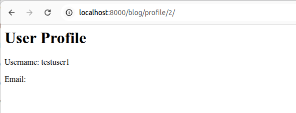

**How to fix it:**

This flaw can be fixed by adding a check to ensure that the profile belongs to the logged-in user. This fix can be found in the code commented out starting from [line 33 of views.py](https://github.com/varkkha/cybersecuritybase-project1/blob/main/src/blog/views.py#L33)

```bash
@login_required
def profile_view(request, user_id):
    if request.user.id != user_id:
        return HttpResponseForbidden("You do not have permission to view this profile.")
    user = get_object_or_404(User, id=user_id)
    return render(request, 'blog/profile.html', {'profile_user': user})
```
Now one cannot see the profile page of another user.

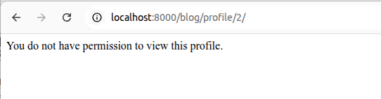

### Flaw 2: A03:2021-Injection

**Source link:**
See the code on [line 41 of views.py](https://github.com/varkkha/cybersecuritybase-project1/blob/main/src/blog/views.py#L41)

**Description of flaw:**

In SQL injection vulnerability, the unsafe use of SQL queries allows attackers to manipulate database queries by using crafted input.

In this sofware, the flaw comes from the unsafe_search(request) view where user's input is directly embedded in an SQL query without using proper sanitization. With this vulnerable code, the user can access the following URL with a crafted parameter: "http://localhost:8000/blog/unsafe-search/?name=' OR '1'='1" and this will return all users from the auth_user table instead of just one, revealing sensitive user data.

In the snapshot below, when visiting url "http://localhost:8000/blog/unsafe-search/?name=' OR '1'='1", user can see listed all the users. In the case of the screenshot, there are two users created: testuser1 and admin.

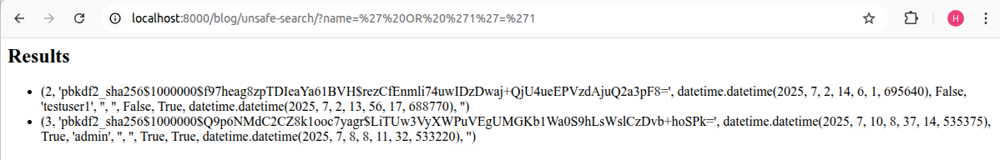

**How to fix it:**

This flaw can be fixed by replacing the vulnerable query with a parameterized one. This ensures that user input is handled safely. This fix can be found in the code commented out starting from [line 49 of views.py](https://github.com/varkkha/cybersecuritybase-project1/blob/main/src/blog/views.py#L49)

Now, when trying to open URL "http://localhost:8000/blog/unsafe-search/?name=' OR '1'='1" the results page is empty, because "OR '1'='1" is not anymore SQL injection, but just a string. So the database looks for a username literally matching ' OR '1'='1, which doesn't exist, resulting in an empty results page. This prevents the classic SQL injection attack from succeeding.

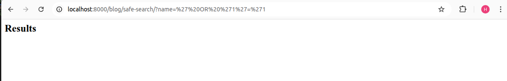

### Flaw 3: A04:2021-Insecure Design

**Source link:**
See the code on [line 57 of views.py](https://github.com/varkkha/cybersecuritybase-project1/blob/main/src/blog/views.py#L57)

**Description of flaw:**

Insecure design can include a large variety of different kinds of weaknesses. This software has a vulnerability with API key as the API view uses a hardcoded API key. This is insecure since the key is directly embedded in the source code, and that way it can leak through version control or code sharing. The flaw can be found on [line 60 of views.py](https://github.com/varkkha/cybersecuritybase-project1/blob/main/src/blog/views.py#L60)

When opening URL http://localhost:8000/blog/secret-api/?apikey=my-secret-api-key, one can see the secret data, see the screenshot below.

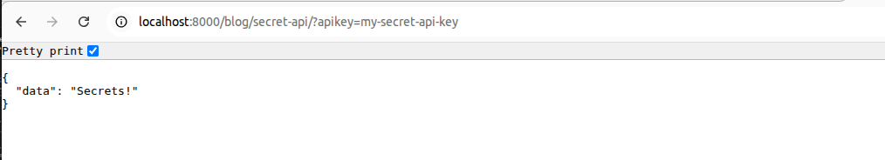

**How to fix it:**

This flaw can be fixed by storing the API key to .env file and loading it securely at runtime. Now, only requests with the correct API key stored in the environment file will see the secret data.

Thus, when fixin the flaw, one should add enviroment file .env and add the API key there:
```bash
API_KEY=my-secret-api-key
```
After that, the view.py should be changed to a version where the API key is loaded from .env file. The fixed code can be found as commented out starting from [line 65 of views.py](https://github.com/varkkha/cybersecuritybase-project1/blob/main/src/blog/views.py#L65)
```bash
API_KEY = config('API_KEY')

def secret_api(request):
    key = request.GET.get('apikey')

    if key == API_KEY:
        return JsonResponse({'data': 'Secrets!'})
    else:
        return JsonResponse({'error': 'Incorrect API key'}, status=403)
```

The before and after screenshots look visually identical because both show the secret data page:

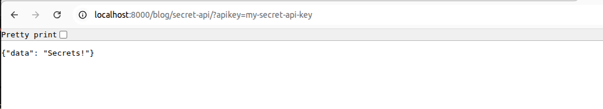

However, in the fixed version, if you try to access the API with an incorrect or missing API key, the data will be hidden or an error shown:

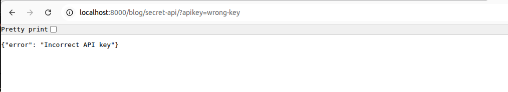

### Flaw 4: A05:2021-Security Misconfiguration

**Source link:**
See the code on [line 27 of settings.py](https://github.com/varkkha/cybersecuritybase-project1/blob/main/src/app/settings.py#L27)

**Description of flaw:**

One security misconfiguration can be leaving to Django application's production settings DEBUG = True. This can expose sensitive internal information, and make application vulnerable to attacks.

In this application the flaw can be found on settings.py file line 27:
```bash
DEBUG = True
```

Now if one opens a non-existent page like URL http://localhost:8000/blog/error-test/, one can see Django's error page and there for example the stack trace, file paths and possible variable values.

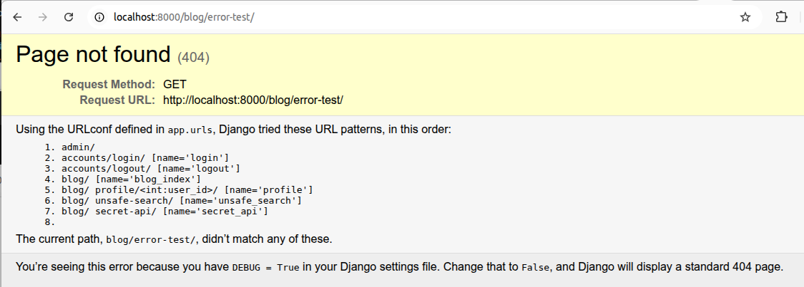

**How to fix it:**

This vulnerability can be mitigated by moving the debug flag to an environment variable and setting allowed hosts explicitly. The fix can be found starting from [line 30 of settings.py](https://github.com/varkkha/cybersecuritybase-project1/blob/main/src/app/settings.py#L30)

Thus, these rows should be added to settings.py:
```bash
DEBUG = config('DEBUG', cast=bool)
ALLOWED_HOSTS = ['localhost', '127.0.0.1',]
```

And to .env file should be added
```bash
DEBUG=False
```

After this fix, Django no longer exposes internal error details when a page is missing and only a generic "Not Found" page will appear:

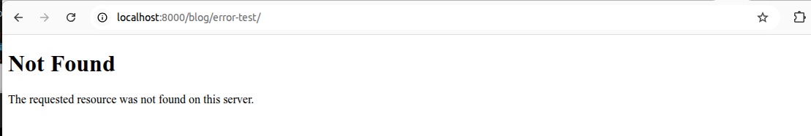

### Flaw 5: Cross-Site Request Forgery (CSRF)

**Source link:**
See the code on [line 12 of views.py](https://github.com/varkkha/cybersecuritybase-project1/blob/main/src/blog/views.py#L12)

**Description of flaw:**

This vulnerability is an example of Cross-Site Reguest Forgery (CSRF). With this vulnerability, the attacker can trick a logged-in user's browser to perform unwanted actions on their behalf. This can lead to situations where for example user is forced to perform unauthorized fund transfers, email address changes and other sensitive operations.

In this software, the flaw is on line 12:
```bash
@csrf_exempt
```

This decorator disables the Django's built-in CSRF mechanism. As a result, an attacker could trick a logged-in user into submitting a POST request from a malicious website without the user's knowledge or consent.

For example, we have an attacker.html file saved on somewhere outside this software project. If we run on that folder the following code:
```bash
python3 -m http.server 8081
```

And then open url http://localhost:8081/attacker.html, a blog post, that we have not added ourselves, appears to blog posts:

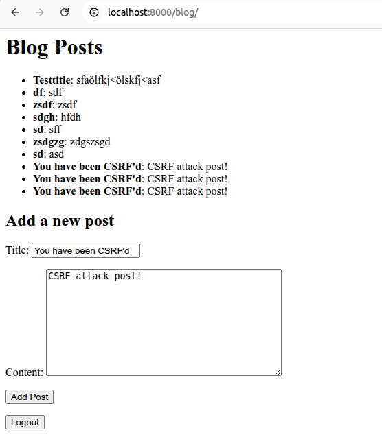

**How to fix it:**

This flaw can be fixed by removing the @csrf_exempt decorator from the view. When the decorator is removed, Django will enforce CSRF protection and require a valid token for each POST request.

After removing the @csrf_exempt decorator from the view, we get an error because CSRF protection works:

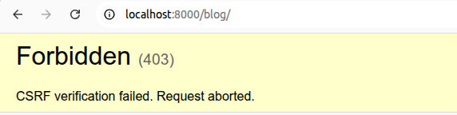

**References:**
- https://owasp.org/www-project-top-ten/
- https://owasp.org/Top10/A01_2021-Broken_Access_Control/
- https://owasp.org/Top10/A03_2021-Injection/
- https://owasp.org/Top10/A04_2021-Insecure_Design/
- https://owasp.org/Top10/A05_2021-Security_Misconfiguration/
- https://owasp.org/www-community/attacks/csrf

