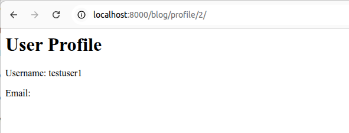
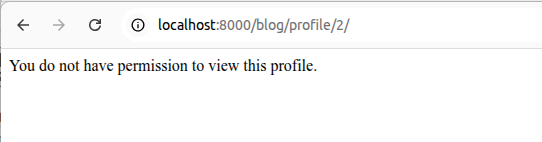

# Cyber Security Base - Project I

### LINK: https://github.com/varkkha/cybersecuritybase-project1

## Installation instructions

1. Clone the repository and move to the root folder
```bash
git clone git@github.com:varkkha/cybersecuritybase-project1.git
cd cybersecuritybase-project1
```

2. Set up a virtual environment
```bash
python3 -m venv venv
source venv/bin/activate
```

3. Install dependencies
```bash
pip install -r requirements.txt
```

4. Create a .env file in the root folder with the following content:
```bash
SECRET_KEY=your_secret_key_here
DEBUG=True
```

5. Run migrations. Make sure you're in the src folder.
```bash
cd src
python manage.py migrate
```
6. Start the development server
```bash
python manage.py runserver
```
7. Visit http://localhost:8000 in your browser

## Security flaws

This software has been constructed for the course _Cyber Security Base: Course Project I_. It has five security flaws that are pointed out below. In addition, there are provided the steps to fix them.

### Flaw 1: A01:2021-Broken Access Control

**Source link:**
https://vscode.dev/github/varkkha/cybersecuritybase-project1/blob/main/src/blog/views.py#L24

**Description of flaw:**
In this flaw, users can act outside of their intented permissions because the system does not properly verify the ownership. The inadequate verification can lead to unauthorized access, data breaches, and potential manipulation or destruction of other users’ sensitive information.

The flaw comes from views.py file where view_profile(request, user_id) view does not check that the profile belongs to the logged in user. This view allows any authenticated user to access any profile by simply changing the user_id in the URL.

```bash
def profile_view(request, user_id):
    user = get_object_or_404(User, id=user_id)
    return render(request, 'blog/profile.html', {'profile_user': user})
```

In the snapshot below, signed in is user with user_id = 3. But if one opens url http://localhost:8000/blog/profile/2/, that includes user_id = 2 information, I can see user_id = 2 profile information.



**How to fix it:**

This flaw can be fixed by adding a check to ensure that the profile belongs to the logged-in user. This fix can be found in the code commented out.

```bash
@login_required
def profile_view(request, user_id):
    if request.user.id != user_id:
        return HttpResponseForbidden("You do not have permission to view this profile.")
    user = get_object_or_404(User, id=user_id)
    return render(request, 'blog/profile.html', {'profile_user': user})
```
Now one cannot see the profile page of another user.


